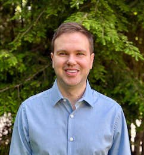

# About Me

 "My Photo"

### Computer Science Experience
I am a computer science major at SUNY New Paltz with coursework spanning two semesters of web development and one semester each of iOS and Android app development. My past projects include a Ruby on Rails retail site, a book recommendation single page app, and a collaborative Java web application for reviewing media such as movies, music, and games. The last project introduced me to RESTful APIs and stateless application design. I also have professional experience working with databases and ERP systems from my time working in a chem lab in an industrial setting.

### Hopes for this Course
In this course, I see myself applying the MEVN stack to build a more complete and production-oriented full-stack application. I am particularly interested in strengthening my backend skills, including API design, authentication, and authorization, and carrying those patterns into personal projects and future work. My goal is to use this course to improve both the structure and completeness of my portfolio and to gain experience building and deploying a cohesive full-stack system.
